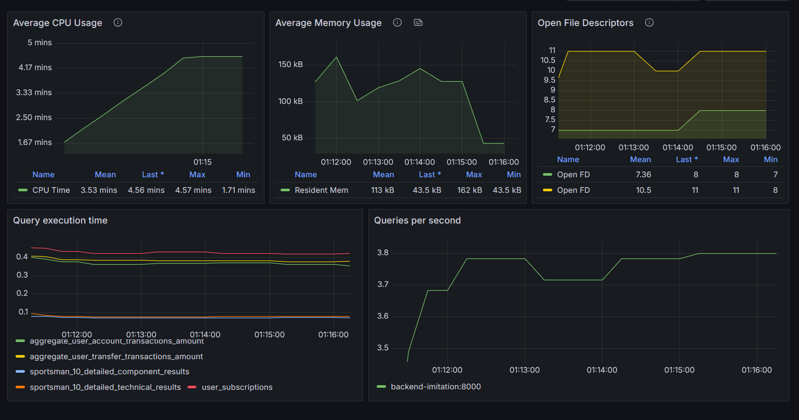

## Краткое описание

Учебный проект, разработанный в рамках курса "Проектирование баз данных". Изучив сервис ФК+ (социальная сеть для любителей фигурного катания), была спроектирована база данных, отражающая сущности ('Пользователи', 'Спортсмены', 'Соревнования'...) и взаимосвязи между ними.

## Перечень использумых инструментов/технологий

PostgreSQL, Docker, Flyway, Bash, Python, Faker, Prometheus, prometheus_client, Grafana, Patroni, etcd, Haproxy

## Запуск

Развертывание кластера:

    make run

## Переменные окружения

* CREATOR_NAME - пользователь, от имени которого будет создана база данных

* CREATOR_PASSWORD - пароль пользователя

* MY_DB - название создаваемой базы данных

* MIGRATION_VERSION - до какой версии выполнять миграции. Если переменная не указана, выполняются все миграции

* APP_ENV - окружение. Если указано *dev*, будет запущено сидирование

* SEED_COUNT - переменная, влияющая на число сгенерированных во время сидирования данных

* ANALYST_NAMES - имена пользователей, имеющих роли аналитиков

* BACKUP_RETENTION_COUNT - количетсво хранящихся бэкапов

* BACKUP_INTERVAL_CRON - интервал создания бэкапов

## Функционал и инструменты

Поднимается откзоустойчивый PostgreSQL кластер с двумя репликами. 

* Patroni - используется для управления кластером

* etcd - распределённое хранилище конфигурации
 
* Haproxy - позволяет сделать единую точку входа. Он определяет, кто в данный момент является мастером, а кто репликой, и перенаправляет запросы от клиентов на нужный адрес

После поднятия кластера происходит накатывание миграций (с помощью Flyway) и запуск Python-скриптов сидирования. Сидирование происходит под каждую версию миграций, данные генерируются с помощью библиотеки Faker. Также запускается bash-скрипт создания роли аналитика (дающей право читать данные, но не изменять их) и пользователей, обладающих этой ролью. Проверяется факт сидирования и существования ролей, поэтому повторный запуск будет корректен.

В качестве системы мониторинга используется Prometheus, для построения дашбордов - Grafana.

Написанная имитация бэкенда и собранные метрики помогли выделить запросы, выполняющиеся продолжительное время. Запросы были оптимизированы с помощью B-Tree индексов.

После поднятия кластера создается cron-задача, которая создает бэкапы и удаляет старые.
